+++
date = '2026-09-04T08:36:01-04:00'
draft = true
title = 'TelescopeLevelers'
+++
(Ray O’Connor – 2024)

At the Natural Tunnel State Park where we do outreach, we make use of an older, park-owned telescope; a 10” Meade, Schmidt Cassegrain, model LX-50. We use the scope as you would any other and, knowing the sky as we do, never use its original intended functions. A keypad and small readout screen on a handset prompts the user which direction to slew the scope, guiding you to a known object (e.g. M13, or NGC 884). These older telescopes are known as “Push To” scopes, and are the predecessors to the standard “Go To” scopes, seen everywhere today.

For a variety of reasons, the LX-50 was popular with many State Parks across the nation when it was first released for sale in the late ‘90’s. And many of these stout beasts are still alive and well and doing just fine in their various homes. Some of its best features are its overall heavy duty construction, a robust tripod, the rock-solid wedge of the equatorial mount and most importantly, the clock drive.

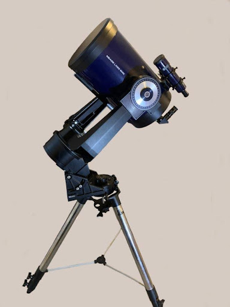

Even at its advanced age, our LX-50 is a real workhorse, and still performs flawlessly, but it does have a few minor drawbacks. It is a very weighty object and the only leveling function is in the slip-fit (with locking knobs), tube-in-tube telescopic legs. Due to its years of use under many different hands, this particular tripod has seen a few hard miles and can be a bit finicky. But if you don’t mind very gently applying brute force to make tiny adjustments numerous times, it does serve to get the scope leveled.

However… as stated, the scope is fairly heavy. The entire setup weighs in at just under a whopping 60LBS., resting on three small rounded feet. Even after getting everything perfectly leveled, including “pre-compressing” the feet down into the sod, over time, the weight of the scope still causes it to settle further into the soil… shifting the scope out of level again. Re-leveling the scope requires extending a leg or two, but in doing so, the foot (or feet) are moved further outward to a new location on the soil… and the process starts again.

Using the scope for evening outreach is no problem, where we rarely hold on an object for more than 20 minutes. But we also use it for regular, four-hour stretches of solar viewing.

Holding on a single object for four hours with a scope that is slowly sinking into the lawn can be tiresome. More often than not, the last hour or so demanded frequent Altitude and/or Azimuth adjustments to keep those sunspots in view.

I’d spent quite a lot of moments pondering different ways to avoid the settling problem. Mainly, I’d been considering hard pads (mulled over in an assortment of materials) with a small cup, or recess on top to prevent the scope from shifting. That would have been an easy fix, but that still left adjusting and readjusting those cumbersome legs… and moving the pads with each adjustment. What was needed was a way to tweak the height of each foot, to make those minor adjustments, without the tedious task of altering the legs.

What I’ve come up with is a set of levelers that requires just a few readily available parts, a little bit of metalwork, and some tack welding. (We had the Maintenance Shop at the park weld the pieces for us.) They are fairly simple to make and far simpler to use. Only a couple of the steps are critical, and nearly all of the dimensions are arbitrary. This size works for us, but you can make them any size you like. And above all, they do not allow a heavy scope to settle any further. Once leveled, the tripod stays level, and our only concern is staying hydrated.

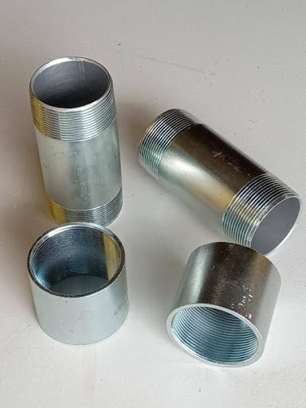

We start with 2” rigid electrical conduit fittings. You’ll need two (2) short (3” or 5” long) nipples (short connectors with external threaded ends), and two (2) couplers (with internal threads). These can be found at most Home Centers.

You’ll need to test fit all the threads to make sure they run freely, by hand, all the way to the end of the threads. Test each end of both nipples (all 4 of them) with both ends of both couplers (all 4 of these too). You want to make sure that all of the parts fit with all of the other parts, without binding, in all 16 combinations.

This simple test fitting will ensure you’re not getting any damaged threads or poorly made parts. It will also save you the hassle of having to keep track of pairs of threaded parts that only fit well with each other… and then keeping them paired throughout the project.

All of the 3” nipples ($8.00 ea.) I tested at the store were ill-fitting and jammed halfway through their travel. The 5” nipples ($10.00 ea.) were better made and every combination of parts paired easily through the entire length of the threads without any restraint at all.

We will need three (3), 4” X 4” squares of stiff sheet metal (3/32” or 1/8” thick).

And three (3) squares 3 1/2” X 3 1/2” (same thickness).

Any welding or machine shop will have scraps of sheet stock that will yield pieces in those sizes, and they’d probably be happy to part with some scrap pieces for a few bucks. If you don’t want the labor of cutting the squares (and if the metal shop isn’t too busy), they might cut them for you for a few dollars more.

I had some 1/8” sheet metal on hand, so I cut these parts myself. I don’t know what the cost of these parts might be in your area.

You’ll also need three (3), 3/4” or 1” flat washers ($1.00 ea.). The size washers you’ll need depends on your equipment. Check the feet of your tripod to make sure they will protrude at least partway through the holes in the washers.

Not all flat washers are created equal. Tolerances on flat washers are fairly lax and quite often they’re stamped from varying thicknesses of mis-milled sheet stock. If your store has a bin of them, take a handful and stack them across your palm like coins. You may notice that some of them are thicker than others. Choose the thicker ones. (If the only ones available are thin, cheap ones, look elsewhere for them. Farm Supply stores usually stock larger size nuts and bolts.)

Our full material list is:
Two (2), 2”, rigid electrical conduit couplers
Two (2), 2” inside diameter, rigid electrical conduit nipples – short lengths, 3” – 5” long
Three (3) squares of stiff sheet steel, 4” X 4” (3/32” – 1/8” thick)
Three (3) squares of stiff sheet steel, 3 1/2” X 3 1/2” (same thickness)
Three (3) large Flat Washers (3/4” – 1” inside diameter)

First, we’ll need to part the couplers into two even pieces. Mark the center line and score the coupler partway (1/16” deep or more) with a hacksaw all the way around. The saw will follow this score line, rather than following the internal threads, as you cut all the way through.

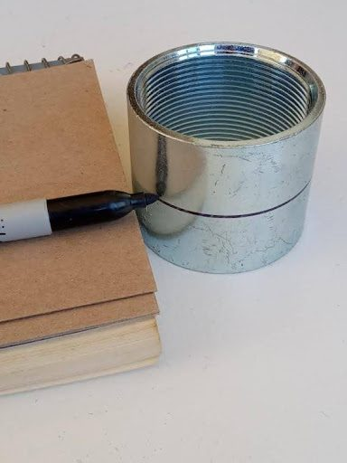 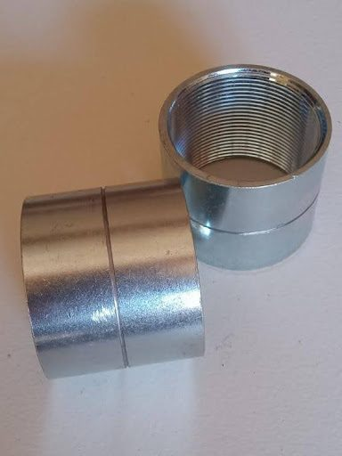

When cutting both the couplers and nipples, you do want your cuts to be as square as you can get them (90 degrees to the travel of the threads). These cut ends should be filed to a flat, smooth surface. These are the surfaces the square plates will be welded to.

A word of caution: The more material you file away, the less height adjustment you will be left with. This is why you want to cut them as square as you can.

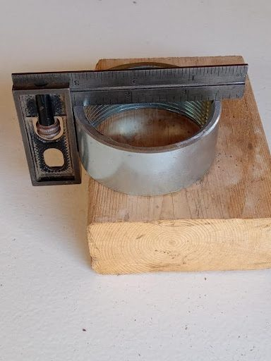

Clean up any rough portions (inside and out) with a file (use a round file for the inside), making sure not to distort the threads.

Now, cut the threaded ends off the nipples. Again, cut and file the pieces as square as you can get them, and file off any rough edges.

= = = = = = = = = = = = = = = =

NOTE:

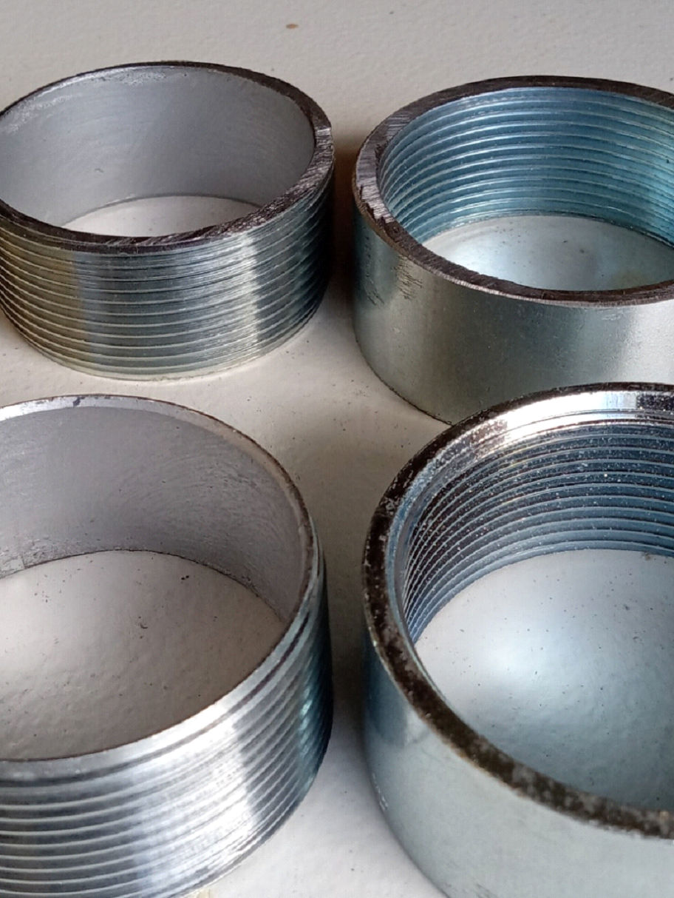

The factory-machined, outside ends of both the couplers and nipples (foreground, above) will mate far easier – that is, the threads will catch far easier - than the ends that you’ve cut (background, above). It can become a serious chore, with a ridiculous amount of filing and fitting, to get these newly-cut ends to catch and mesh well. This is why the plates will be welded to the ends that you’ve cut and filed… and also why we want these cut ends to be square and flat.

= = = = = = = = = = = = = = = =

We now have three rings with inside threads (Coupler Rings), and three with outside threads (Nipple Rings), with one extra of each.

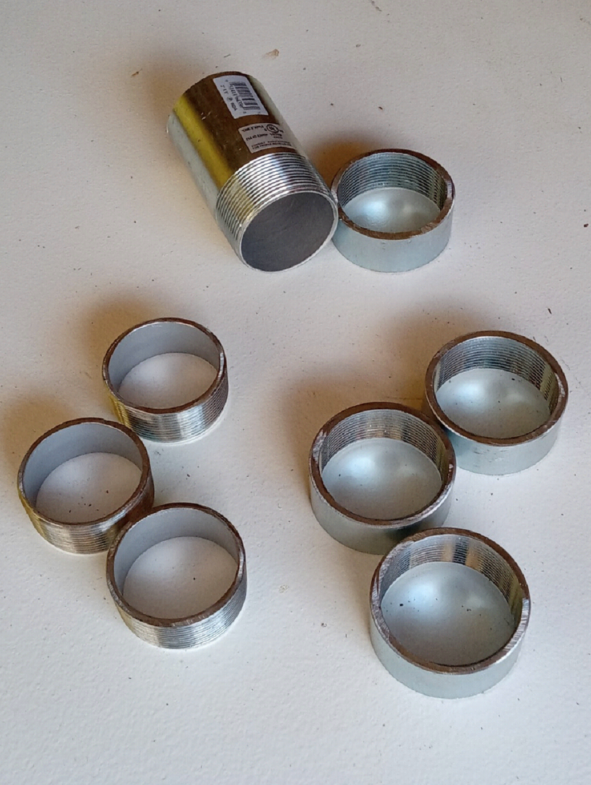

Moving on, to our squares of sheet metal, file down all sharp edges (top, bottom and corners) of all the plates to prevent any cuts or finger nicks while handling.

= = = = = = = = = = = = = = = =

NOTE:

Our next step is an important one. We need to locate and mark the center of the squares, and we’ll be using the corners of these plates to do this. We need to do this now, because we will be altering all of these corners shortly.

The 4” squares (the Base Plates) aren’t that critical, but the 3 1/2” squares (the Top Plates) are going to spin as you adjust the height of the levelers, so we’ll need to keep everything centered.
To mark the very center of these squares, strike a line from corner to corner, forming an “X” on one side of all three 4” squares, and on BOTH sides of all three 3 1/2” squares. A light hammer strike on a pointed center punch or an awl will create a small dimple at the center points.

= = = = = = = = = = = = = = = =

Starting with our 4” squares of sheet metal (the Base Plates), turn all three plates over (side with the center marks down) and work on the underside of these plates.

Measure each corner of the 4” squares 1 and 1/8” inches in from the ends, and mark at a 45 degree angle. Using a vise, bend these triangular corners down at 90 degrees, to form four small “claws”. These claws will dig into the lawn, and prevent the base of the levelers from spinning or shifting anywhere on the grass during use.

Going back to our center marks on the other side, scribe a circle with a compass, just slightly larger than the outside diameter of the coupler rings (inside threads).

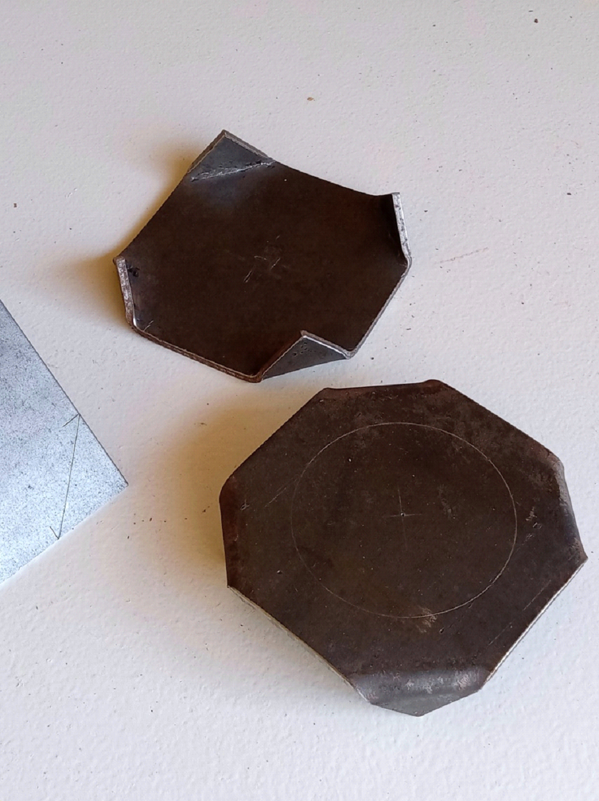

Moving to the 3 1/2” squares of sheet metal (the Top Plates), measure each corner of the squares at 1 and 1/16” in from the ends, and mark at a 45 degree angle to form an octagon. (1 and 1/16” will not give us a perfect octagon, but is certainly close enough for our purposes)

Cut these triangular corners off. Again, file down all sharp edges, top, bottom and corners. If you like, you may want to grind a small scallop on each of the 8 edges of the octagons to create more of a finger grip.

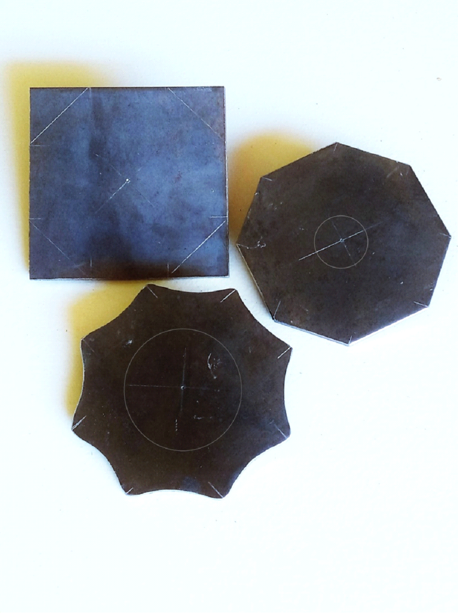

Going back to our center marks, scribe a circle with a compass, just slightly smaller than the inside diameter of the washers on one side of all three Top Plates.

Turn all three Top Plates over, and using our center marks on the other side, scribe a circle just slightly smaller than the inside diameter of the threaded nipple rings (outside threads).

These circles will enable you to easily center these parts on both sides of the Top Plates. If your threaded ring or washer is even slightly off-center when you’re clamping them in place for welding, it will be visibly noticeable.

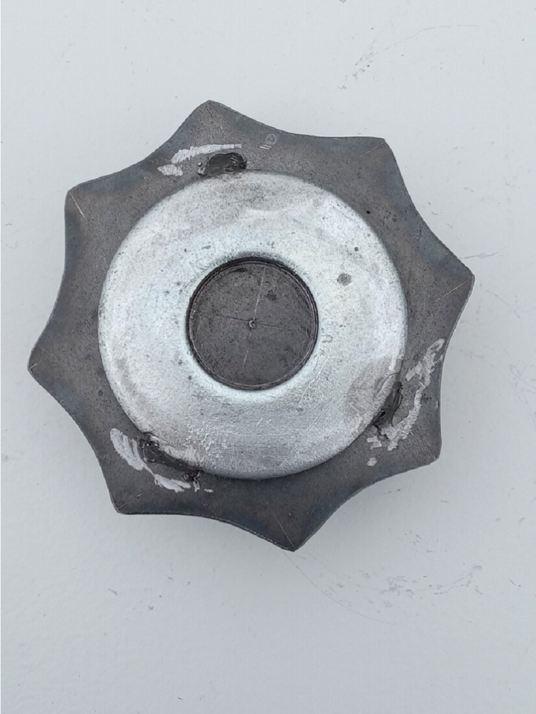

Now we weld.

Using our scribed circles, center the threaded coupler rings (inside threads) with the factory ends UP, on the top of the Base Plates (with the corner claws pointing DOWN). Tack weld in 3 or 4 places, around the OUTSIDE. We don’t want the welds interfering with the travel of the threads.

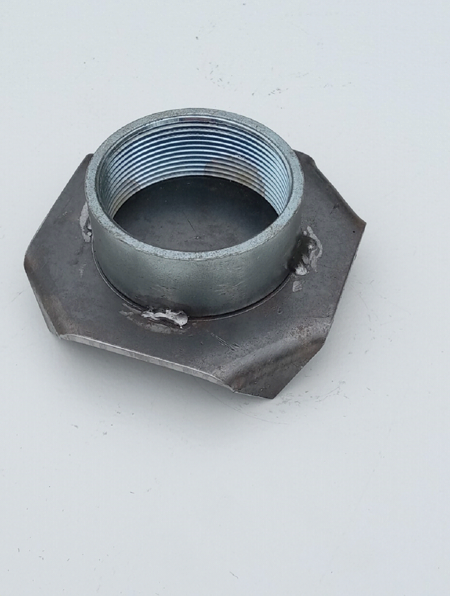

Welding the parts to the Top Plates, once again, we need to be a bit more precise.
It will be easier to clamp the pieces for welding if you start with the washer.
Using our scribed circles, carefully center the flat washers on the tops of the octagonal Top Plates, and tack weld in 3 places around the OUTSIDE edges. This creates a small, centered recess, or “cup”, on the top of the levelers and prevents the scope from shifting off the levelers, should anything get bumped.
This is where the thicker washers prove their worth. Thicker washers provide a deeper recess. (You could always double the thin, cheap washers to give you a deeper cup, but keeping everything aligned can be a severe nuisance.)

Turn these three parts over, upside down.
Using our scribed circles, carefully center the threaded nipple rings (outside threads) with the factory ends UP, on the octagonal Top Plates. Tack weld in 3 or 4 places, around the INSIDE.

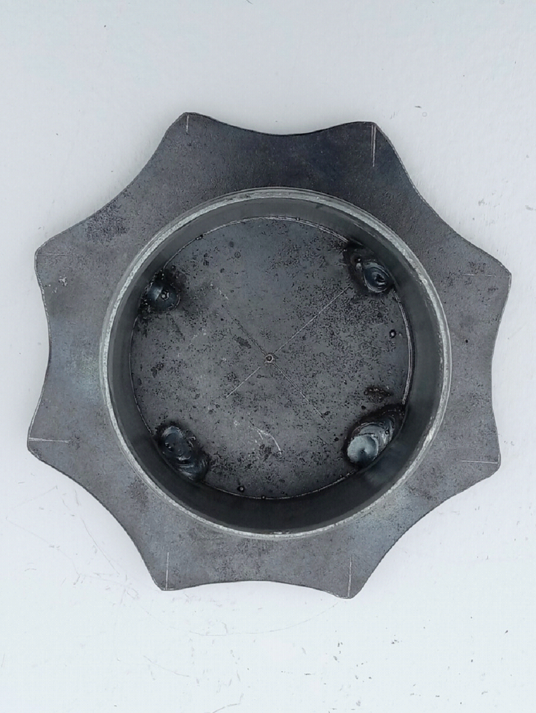

Use a small ball grinder in a Dremel tool to clean up and smooth off all your welds. If you don’t have a Dremel, a round file will also do the job.
Clean all parts with a wire brush, steel wool, or “Scotchbrite” type scouring pad. Cover or tape off all threads, and paint with a good quality, high-visibility epoxy or enamel spray paint, to prevent rust. Your levelers will be at ground level, and we all know too well just how dewy some evenings can get. Gloss paint will wipe clean much easier than a Semi-Gloss or Flat finish paint.
Once the paint is dry, screw the three sets of halves together and they’re ready to use.

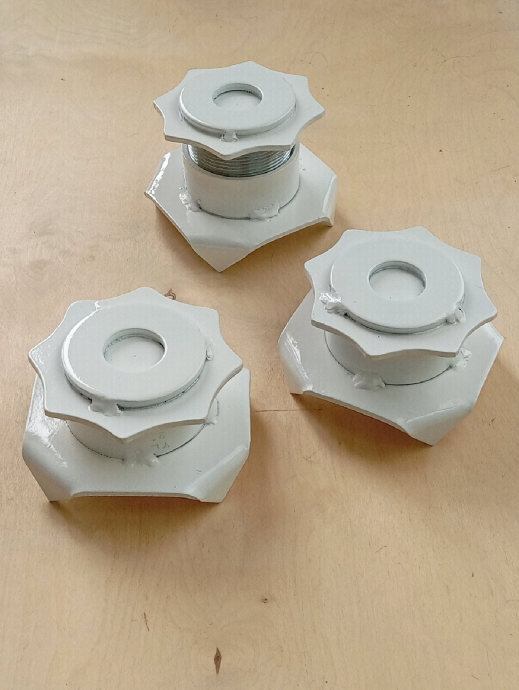

Use:
Level your telescope tripod as you usually would and lock the legs in place. Here, you don’t need to be as exacting as you normally would. Just getting nearly all of the bubble inside the indicator ring will be good enough. There is enough movement in the levelers to get you right where you need to be.
Lower all three levelers to their lowest position, and then back them off a quarter turn or so.
Lift each leg, one at a time, and place a leveler under each foot. (We usually hold the leveler up, against the foot of each leg, and lower them both to the ground, making sure the foot is in the recess on the top.) Take hold of each leg at the foot and add a little weight, pushing straight down, ensuring each leveler is “seated” on the sod. You could always “toe down” the corner claws if you like.

Your scope should still be fairly close to level.
Finish leveling your scope using the levelers, raising the appropriate feet. All your movement now is straight up and down. There is no need to extend or retract the legs any further. Doing so would only force you to readjust the placement of the levelers.

If your scope is as heavy as ours, you may want to slightly lift each leg, taking some of the weight off, if you need to take 2 or 3 full turns as you raise the levelers.
Even if your equipment is heavier than an LX-50, it still won’t compress three 4” pads any further into the soil. And with just over 1” of threads, fine adjustments can be made to bring your scope to perfectly level.
An occasional shot of WD40 and a dab of light oil on the threads should be all the maintenance they need.